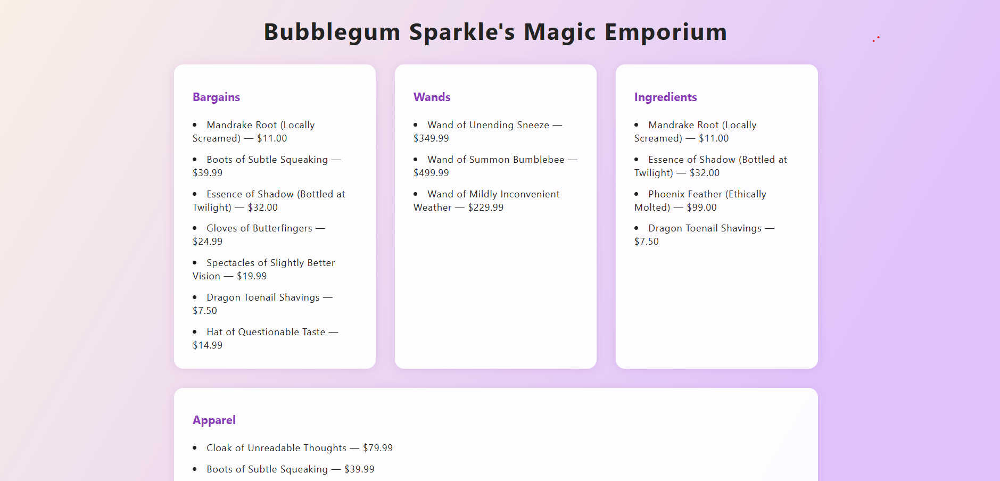

# Chapter 1: The Inheritance

Welcome, new apprentice coder! ✨

You’ve just been summoned by the legendary (and slightly frazzled) **Bubblegum Sparkle**, proud owner of **Bubblegum Sparkle’s Magic Emporium**—the premier source for enchanted odds, ends, and the occasional “mildly inconvenient” wand.

Bubblegum’s message reads:

> “Darling, I tried to make my own shop website, but the cauldrons are showing up under ‘Wands,’ the bargains list keeps screaming errors at me, and the hats refuse to appear at all! I’m in over my head—and up to my elbows in dragon toenails. Can you work some magic?”

As Bubblegum’s chosen developer, your quest: **fix the shop’s code, debug the disasters, and get the magical merchandise flowing again!**

---

## Getting Started: Project Setup

Let’s conjure the project onto your computer:

1. **Open Git Bash.**
   Hit the **Windows key** and type **Git Bash**. Look for this icon: 
   Then click to open the program. (If you can't find it, ask your instructor!)

2. **Travel to the right drive.**
   Type the following and press Enter:

   ```
   cd f:
   ```

   *(If your instructor tells you a different drive letter, use that instead!)*

3. **Run the Magical Shop setup script.**

   **Copy, paste, and run the following command in Git Bash:**

   ```bash
   curl -fsSL "https://raw.githubusercontent.com/herringvoices/teaching-projects/refs/heads/main/javascript/unit-2-magic-shop/scripts/setup.sh" | bash
   ```

   **Tip:** In Git Bash, you usually paste by **right-clicking** in the window and selecting **paste** (Ctrl+V probably won't work)

4. **Open your new project in VS Code.**
   When the script is finished, you’ll see a new folder in your files named `magical-shop`.
   Open that folder in VS Code.

5. **Use Live Server to open the site.**
   Right-click `index.html` in VS Code and choose “Open with Live Server.”

6. **Marvel at Bubblegum’s beautiful (and completely bonkers) website.**

---

## Explore the Website

Take a few minutes to look around your new site in the browser.
Which sections look weird, broken, or empty? Which ones are working as expected?
What’s surprising or just plain *wrong*?

> **Don’t worry about fixing anything yet.**
> For now, just get curious—notice what’s off, but don’t try to debug or change anything.
> In the next chapter, you’ll learn how to start tracking down and fixing these magical mishaps, step by step!

---

By the time you're finished with all the chapters, your site should look something like this mockup:




---

Ready to start your first debugging adventure?
[Next Chapter →](./magic-shop-chapter-2.md)