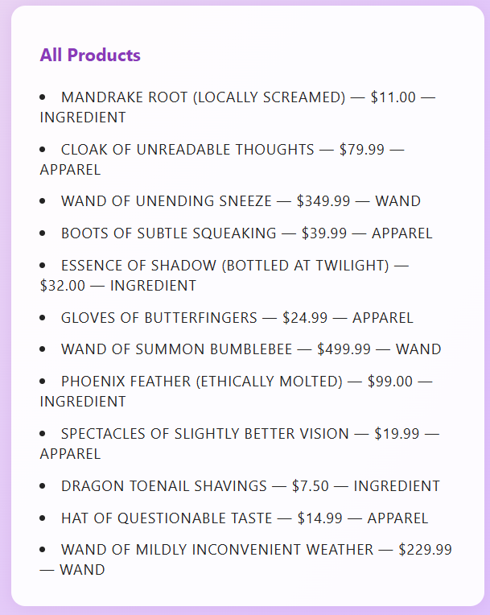

# Chapter 3: The Uppercase Fiasco

Just when you thought the shop couldn’t get any messier, Bubblegum bursts into your workspace with *yet another* “brilliant” idea—brought to you by the Marketing Department™:

> “We MUST list every product under an ‘All Products’ heading, and everything should be IN ALL CAPS. Customers love to be yelled at by their shopping carts!”

To save money (and because her cousin’s roommate took a coding class once), Bubblegum tried to implement it herself.
It, uh… does not work.

---

## Your Tasks

**1. Add a new “All Products” section to the website.**
You’ll need:

* A new heading: `All Products`
* An empty `<ul>` with an id (like `all-products-list`)

---

**2. Get all products to display in that new list.**
You’ve been given the Marketing team’s *full* implementation attempt — loop and all.
Your job is to connect it to the DOM, run it, and debug the mess they’ve made.

💡 **Need a refresher?**
Not sure how to add each product to the new `<ul>` on the page?
Think back to the *League of (Somewhat) Super Heroes* project:

1. Loop through your array of products.
2. For each one, create a string (or `<li>`) with the info you want to show.
3. Add it to the inner HTML of your new `<ul>`.

The good news: they *did* give you a loop.
The bad news: everything inside the loop is wrong. Your mission: fix it.

---

**3. Debug!**
The Marketing team’s code… is not good.
You’ll need to:

* Hook up the code as given.
* Open the Console and read the error messages.
* **Only after seeing the errors** should you start fixing the function so every product’s description, price, and type appears in ALL CAPS under your new list.

If you need a reference on how `.toUpperCase()` is supposed to work, check out [w3schools: JavaScript String toUpperCase()](https://www.w3schools.com/jsref/jsref_touppercase.asp).

---

## The Marketing Team’s Attempt

Here’s what they left for you:

```js
const allCaps = (product) => {
    const upperDescription = product.toUpperCase();
    const upperPrice = price.toUpperCase();
    const upperType = type.toUpperCase();
    return allUpperCase;
};

// This will build the list HTML using the allCaps function above.
// (Yes, it’s intentionally using the broken version they gave you!)
let allProductsHTML = "";
for (const product of inventory) {
    allProductsHTML += `<li>${allCaps(product)}</li>`;
}

allProducts.innerHTML = allProductsHTML;
```

---

### Remember:

* **Run it first** and see what errors happen before changing anything.
* Your goal is to get every product’s description, price, and type in ALL CAPS in your new list.
* Don’t just `console.log()` it—make it show up on the actual page.

---

### When You’re Done

Your All Products section should look something like this:



---

When your “All Products” section is working and looking as SHOUTY as Marketing wants,
[← Previous Chapter](./magic-shop-chapter-2.md) | [Next Chapter →](./magic-shop-chapter-4.md)

