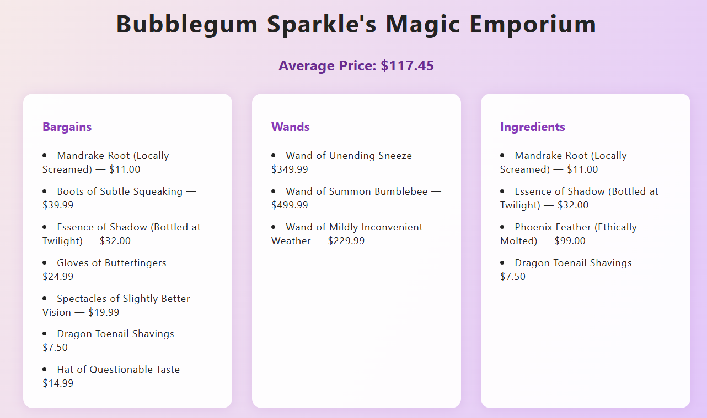

# Chapter 4: The Curse of NaN
Just as you finally wrangle the product listings into all-caps glory, Bubblegum bursts in again—this time clutching a marketing memo, several empty coffee cups, and what may or may not be a live toad.
[← Previous Chapter](./magic-shop-chapter-2.md) | [Next Chapter →](./magic-shop-chapter-5.md)
>
> Anyway, I tried to make it work, but all I get is this thing called ‘NaN.’ Is that short for ‘Nice and Neat’? Because my numbers sure aren’t!”

---

Now, *you* already know that **NaN** stands for **Not a Number**. It’s a special value in JavaScript that means *the result of a calculation is not a valid number.* This usually happens when:

* You try to do math with something that isn’t a number (like dividing a string by a number).
* You accidentally use the wrong property or variable that doesn’t contain a number.
* You divide by zero or perform an operation that just can’t produce a meaningful number.

When your code returns `NaN`, it’s a clear sign that something went wrong in your calculations—and the browser is politely telling you it can’t figure out a real number to show.

---

## Your Tasks

1. **Add a place at the very top of the webpage to display the average price.**
   You might use a `<div>` or `<h3>` or whatever you like, but make sure it’s clear and visible.

2. **Use the broken average price function below (straight from Marketing).**
   Try hooking it up as-is, and see what happens.
   Open the Console and Dev Tools to figure out what’s going wrong.

3. **Fix the code so it shows the correct average price on the page.**
   When you’ve fixed it, the number should look like a real price—no `NaN` allowed!
   Bonus points if you get it to show two decimal places (e.g., \$54.87).

4. **If you want help with math in JS, here’s a reference:**
   [w3schools: JavaScript Numbers](https://www.w3schools.com/js/js_numbers.asp)

---

## The Marketing Team’s Attempt

```js
const calculateAveragePrice = (products) => {
    const allPrices = products.price;
    const averagePrice = allPrices / products.length;

    return averagePrice;
};
```

---

### When You're Done:



---

When you’ve successfully cast away the curse of NaN and your average price shines at the top of the page,
[← Previous Chapter](./magic-shop-chapter-2.md) | [Next Chapter →](./magic-shop-chapter-4.md)

---
