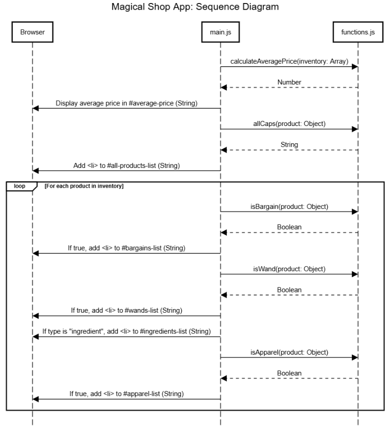
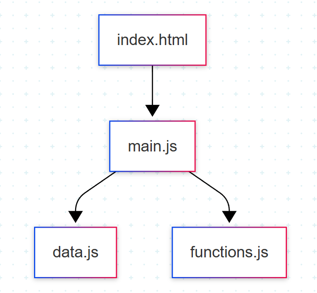

# Chapter 7: Sequencing the Spell (Reading Sequence Diagrams & Dependency Graphs)

Your magical shop's code has many parts working together: data, functions, and rendering. Understanding **how** these parts interact over time and **what flows between them** helps you debug and maintain your code.

To do that, you'll use two diagrams:

* A **Sequence Diagram** showing what functions are called, with what arguments and return types, in the order they happen.
* A **Dependency Graph** showing how your files/modules depend on each other (which files import which).

---

## The Sequence Diagram — What It Shows

A **sequence diagram** traces the flow of your program step-by-step. Each vertical line represents an object or module. Arrows between lines show function or method calls.

In our Magical Shop sequence diagram, you'll see:

* **Who calls what** (e.g., `main.js` calls `calculateAveragePrice` and `allCaps` functions).
* **What arguments are passed in** (e.g., `calculateAveragePrice` receives the entire `inventory` array, `allCaps` receives individual product objects).
* **The data types** of those arguments (e.g., `inventory` is an array of objects, `product` is a single object).
* **What the function returns** (e.g., `calculateAveragePrice` returns a Number, `allCaps` returns a String, filter functions like `isBargain` return Boolean values).

---

### Example Breakdown

1. **Browser loads and executes `main.js`.**
   (No arguments, triggers initialization and imports.)

2. **`main.js` imports data and functions**
   * Imports `inventory` array from `data.js`
   * Imports utility functions from `functions.js`: `calculateAveragePrice`, `allCaps`, `isBargain`, `isApparel`, `isWand`

3. **`main.js` calls `calculateAveragePrice(inventory: Array)`**
   * Argument: `inventory` is the full array of product objects
   * Return: Number (the calculated average price)
   * This result gets displayed in the `#average-price` element

4. **For each product, `main.js` calls `allCaps(product: Object)`**
   * Argument: `product` is a single product object (`{ id: number, description: string, price: number, type: string }`)
   * Return: String (the product description in all capitals)
   * This formatted string gets added to the `#all-products-list`

5. **For each product, filter functions determine which lists to add to:**
   * `isBargain(product: Object)` → Boolean (adds to `#bargains-list` if true)
   * `isWand(product: Object)` → Boolean (adds to `#wands-list` if true)
   * Ingredient check is done inline (adds to `#ingredients-list` if `type === "ingredient"`)
   * `isApparel(product: Object)` → Boolean (adds to `#apparel-list` if true)

---

## The Dependency Graph — What It Shows

The **dependency graph** is a static diagram showing how your files/modules rely on each other.

For example:

* `main.js` depends on (imports) `data.js` and `functions.js`.
* `data.js` exports the `inventory` array.
* `functions.js` exports utility functions like `isBargain` and `isWand`.

This graph helps you understand:

* How changes in one file affect others
* Where to look if something isn't imported or isn't working
* How your project is structured logically

---

## Your Tasks

1. **Look carefully at the sequence diagram**

   * Follow each function call, noting what arguments are passed and what types they are.
   * Notice what each function returns or does.

2. **Study the dependency graph**

   * Identify which files depend on which.
   * Think about how data and functions move between files.
---

## Sequence Diagram

## Dependency Graph

---

## Reflection Questions

* According to the sequence diagram, what arguments does `allCaps()` expect? What is its return type?

* Which module provides the product data, and which modules consume it?

* How does the sequence diagram show the flow from calculating the average price to displaying it on the page?

* If the "All Products" list isn't updating, what does the dependency graph suggest you check first?

---

[← Previous Chapter](./magic-shop-chapter-6.md)